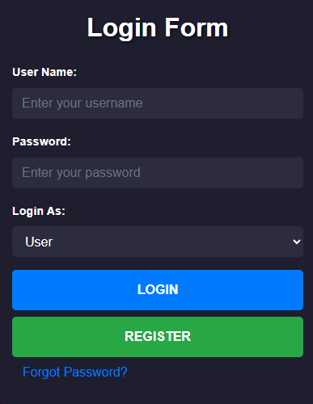
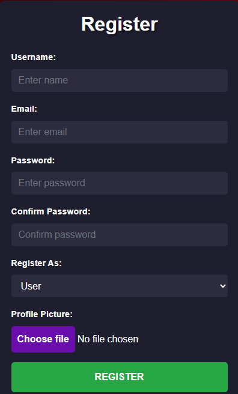
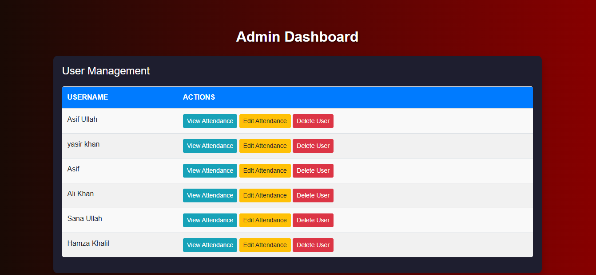
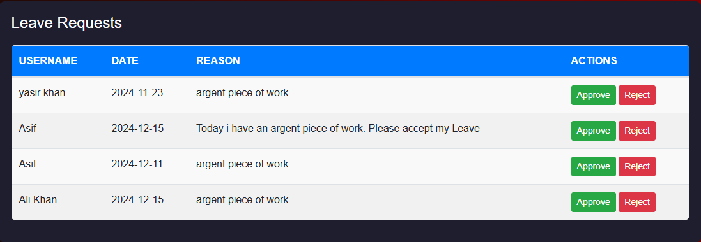
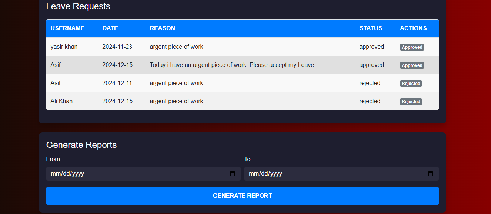
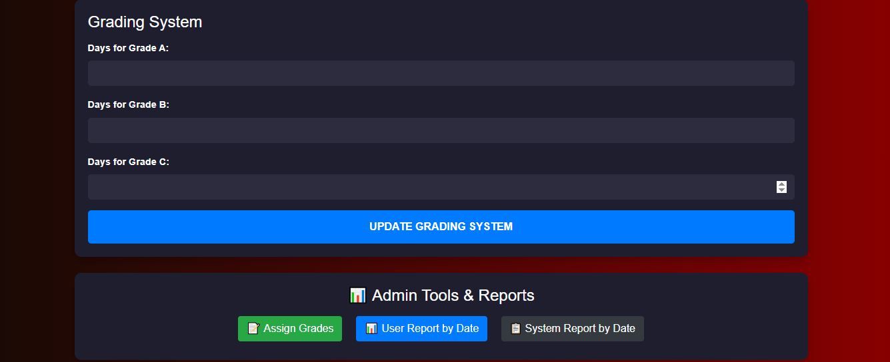

# Flask Attendance Management System 🎓

A full-featured **Flask-based attendance system** with both **admin panel** and **user panel**, built using Flask, SQLite, and Bootstrap.

## 🚀 Features

### 👨‍🎓 User Panel
- Register/Login securely
- Mark attendance with date & time
- Submit leave requests
- Edit user profile (with photo upload)
- View personal attendance report

### 🛠️ Admin Panel
- View and manage users
- Approve/Reject leave requests
- View and edit user attendance
- Assign grades based on attendance frequency
- Filter attendance by date range (per user or system-wide)
- Generate PDF/Excel-ready reports

## 📊 Grading System
Grades are calculated based on present days:
| Days Present | Grade |
|--------------|-------|
| 26 or more   | A     |
| 20 - 25      | B     |
| 15 - 19      | C     |
| 10 - 14      | D     |
| Below 10     | F     |


### 📁 Folder Structure

```
attendance-system/
├── app.py
├── attendance.db
├── .gitignore
├── README.md
├── requirements.txt
├── screenshots/
│   ├── login.png
│   ├── registration.png
│   ├── user_dashboard.png
│   ├── admin_dashboard.png
│   ├── approve_and_rejection.png
│   ├── grading_system.png
│   └── action_work.png
├── static/
│   └── profile_pics/
├── templates/
│   ├── login.html
│   ├── register.html
│   ├── user_dashboard.html
│   ├── admin_dashboard.html
│   ├── edit_profile.html
│   ├── report.html
│   ├── system_report.html
│   ├── user_report.html
│   ├── grades.html
│   └── edit_attendance.html
```

## 🧪 Tech Stack
- Python 3.13.5
- Flask (Backend Framework)
- SQLite (Database)
- HTML5 + Bootstrap 4 (Frontend)
- Jinja2 Templating


## 📸 Screenshots

### 🔐 Login Page


### 📝 Registration Page


### 👤 User Dashboard Page


### 🧑‍💼 Admin Dashboard


### ✅ Leave Approval Panel (Approve / Reject) 


### 🔔 Action Feedback


### 📊 Grading System


## 🛠️ Installation

```bash

# Clone repository
git clone https://github.com/Asif-Ullah-dev/Attendance-System.git
cd attendance-system

# Set up virtual environment
python -m venv venv
venv\Scripts\activate  # for Windows

# Install dependencies
pip install -r requirements.txt

# Run the application
python app.py
```

## 🙋 Author
Made by Asif Ullah


